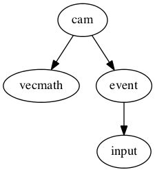

# cam 

A Rust library for 3D camera and navigation.

Maintainer: @bvssvni

## Goals

- 3D camera management for the Piston game engine
- Computing projection matrix
- Computing model-view-projection matrix
- Reexport under Piston

## Dependencies

